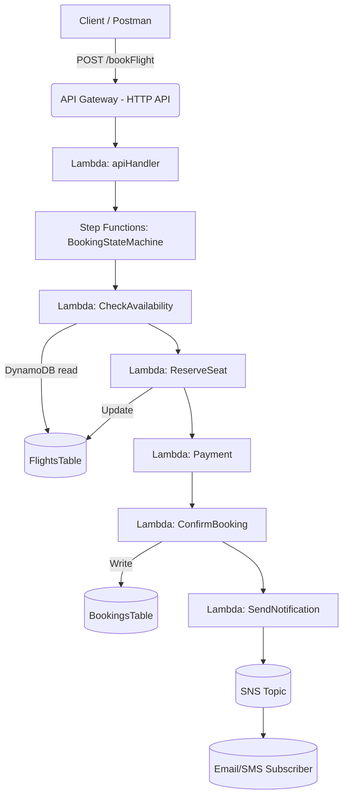

# Airline Booking – Serverless Demo 🚀

A complete **serverless application** built with **AWS SAM** for the **Airline Booking Workflow**.
This was demonstrated in a **1-hour workshop** to showcase how to orchestrate an end-to-end booking process using:

* **API Gateway (HTTP API)**
* **AWS Lambda** (Node.js 22.x, CommonJS)
* **Step Functions** (workflow orchestration)
* **DynamoDB** (data persistence)
* **SNS** (notifications)

---

## 🛫 Use Case

A passenger books a flight through the API.
The workflow runs as follows:

1. **API Gateway** → `POST /bookFlight` → Lambda (`apiHandler`) starts the Step Functions workflow.
2. **CheckAvailability** → Reads from `FlightsTable`.
3. **ReserveSeat** → Atomically decrements available seats.
4. **ProcessPayment** → Mock success (can simulate failure).
5. **ConfirmBooking** → Inserts a new booking into `BookingsTable`.
6. **SendNotification** → Publishes confirmation to SNS (email/SMS).

---

## 🏗 Architecture Diagram



---

## 📂 Project Structure

```
.
├── template.yaml         # SAM template (all resources)
├── samconfig.toml        # Deployment configuration
└── src/                  # Lambda source code
    ├── apiHandler.js
    ├── checkAvailability.js
    ├── reserveSeat.js
    ├── payment.js
    ├── confirmBooking.js
    ├── sendNotification.js
    └── package.json      # dependencies (@aws-sdk/*, uuid)
```

---

## ⚙️ Prerequisites

* AWS Account with IAM access
* [AWS CLI](https://docs.aws.amazon.com/cli/) configured
* [AWS SAM CLI](https://docs.aws.amazon.com/serverless-application-model/)
* Node.js 22.x
* An S3 bucket for SAM artifacts (SAM can auto-create if `resolve_s3=true`)

---

## 🚀 Deployment

```bash
# Build the project
sam build

# Deploy (uses samconfig.toml for params)
sam deploy
```

On success, note the **Outputs**:

* **ApiUrl** → your booking API endpoint
* **StateMachineArn** → Step Functions ARN
* **SnsTopicArn** → SNS topic for notifications

---

## 📥 Seeding Data

```bash
aws dynamodb put-item \
  --table-name FlightsTable-dev \
  --item '{
    "flightId": {"S": "AI-2025"},
    "totalSeats": {"N": "50"},
    "availableSeats": {"N": "10"}
  }'
```

---

## 📩 Subscribe to Notifications

```bash
aws sns subscribe \
  --topic-arn <SnsTopicArn> \
  --protocol email \
  --notification-endpoint your_email@example.com
```

---

## 🧪 Testing

### Postman

* Method: `POST`
* URL: `https://<api-id>.execute-api.<region>.amazonaws.com/dev/bookFlight`
* Header: `Content-Type: application/json`
* Body (raw JSON):

```json
{
  "passengerName": "John Doe",
  "flightId": "AI-2025",
  "paymentInfo": {
    "cardNumber": "4111-1111-1111-1111",
    "amount": 5000
  }
}
```

### curl

```bash
curl -X POST "https://<api-id>.execute-api.<region>.amazonaws.com/dev/bookFlight" \
  -H "Content-Type: application/json" \
  -d '{"passengerName":"John Doe","flightId":"AI-2025","paymentInfo":{"cardNumber":"4111-1111-1111-1111","amount":5000}}'
```

---

## 🔍 Verify the Flow

* **Step Functions Console** → Visual workflow execution.
* **DynamoDB Console** → `BookingsTable` contains the new booking.
* **Email** → Confirmation message from SNS.

---

## 🎯 Next Steps

* Add a **payment failure branch** + seat release compensation.
* Add **auth (JWT / API keys)** for secure API Gateway.
* Deploy with **Express Step Functions** for faster/cheaper execution.
* Add **monitoring dashboards & alerts** with CloudWatch.

---

✅ Now you have a **complete Markdown README** with a **Mermaid diagram** that renders directly on GitHub.

Do you want me to also create a **short architecture PNG** (e.g., via PlantUML or draw.io export) so participants without Mermaid support (e.g., some IDEs) can see the diagram too?
